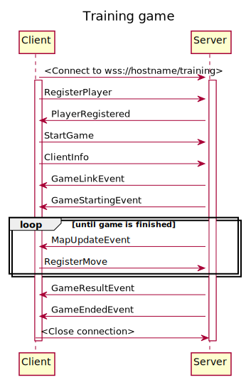

# Client Info

This document gives general information on how the client <=> server communication works as well as expectations and
general info for anyone who want's to implement their own client in a new language.

## Interfaces
It is important that the no matter which language the bot implementer chooses, i.e. which starting client the 
offered functionality should be the same. It should not matter if I choose Java or .NET in terms of functionality
offered to the bot. Below follows interfaces with documentation to serve as an outline for creating your own client. 


[MapUtility](../client-util/src/main/java/se/cygni/paintbot/client/MapUtility.java)
```java

/**
 * Utility for getting information from the map object in a bit more developer friendly format
 */
public interface MapUtility {
    /**
     * Checks if it's possible to move in the direction specified
     * @param direction the direction to check for movement possibility
     * @return  if action is available for movement
     */
    boolean canIMoveInDirection(CharacterAction direction);

    /**
     * Returns an array of coordinates painted in the provided player's colour.
     *
     * @param playerId the id of the player
     * @return an array of MapCoordinate coloured by the player with matching playerId
     */
    MapCoordinate[] getPlayerColouredCoordinates(String playerId);

    /**
     * @return An array containing all MapCoordinates where there's Power ups
     */
    MapCoordinate[] getCoordinatesContainingPowerUps();

    /**
     * @return An array containing all MapCoordinates where there's an Obstacle
     */
    MapCoordinate[] getCoordinatesContainingObstacle();

    /**
     * @param coordinate to check
     * @return true if the TileContent at coordinate is Empty or contains Power Up
     */
    boolean isTileAvailableForMovementTo(MapCoordinate coordinate);

    /**
     * @return The MapCoordinate of your character
     */
    MapCoordinate getMyCoordinate();

    /**
     * Get the character info of the player
     * @return player's CharacterInfo
     */
    CharacterInfo getMyCharacterInfo();

    /**
     * Get character info of a specific player id
     * @param playerId the id of the player too look up
     * @return the character info of the player wrapped in an optional
     */
    Optional<CharacterInfo> getCharacterInfoOf(String playerId);

    /**
     * @param coordinate map coordinate
     * @return whether or not it is out of bounds
     */
    boolean isCoordinateOutOfBounds(MapCoordinate coordinate);

    /**
     * @param coordinate to check
     * @return the TileContent at the specified coordinate
     */
    TileContent getTileAt(MapCoordinate coordinate);

    /**
     * Converts a position in the flattened single array representation
     * of the Map to a MapCoordinate.
     *
     * @param position to convert to coordinate
     * @return coordinate representation of position
     */
    MapCoordinate convertPositionToCoordinate(int position);

    /**
     * Converts a MapCoordinate to the same position in the flattened
     * single array representation of the Map.
     *
     * @param coordinate to convert to position
     * @return position representation of coordinate
     */
    int convertCoordinateToPosition(MapCoordinate coordinate);

    /**
     * Converts a list of positions in array format to list of coordinates.
     *
     * @param positions
     * @return
     */
    MapCoordinate[] convertPositionsToCoordinates(int[] positions);

    /**
     * Converts a list of coordinates to position array format
     * @param coordinates to convert
     * @return position list of converted positions
     */
    int[] convertCoordinatesToPositions(MapCoordinate[] coordinates);
}
```


[IMap](../api/src/main/java/se/cygni/paintbot/api/model/IMap.java)

Also take a look at some relevant models in the same package, such as CharacterInfo, CollisionInfo and ExplosionInfo
```java 

/**
 * The map representing the world the bots play in
 */
public interface IMap {
    /**
     *
     * @return width of the map
     */
    int getWidth();

    /**
     *
     * @return height of the map
     */
    int getHeight();

    /**
     *
     * @return array of info for the different characters (players) on the map
     */
    CharacterInfo[] getCharacterInfos();

    /**
     *
     * @return the current world tick, game consist of X ticks.
     */
    long getWorldTick();

    /**
     *
     * @return array of positions with power ups
     */
    int[] getPowerUpPositions();

    /**
     *
     * @return array of positions with obstacles
     */
    int[] getObstaclePositions();

    /**
     *
     * @return array of positions where there is a collision occurring and which characters are involved
     */
    CollisionInfo[] getCollisionInfos();

    /**
     *
     * @return array of positions where there is an explosion occurring and which characters are causing it
     */
    ExplosionInfo[] getExplosionInfos();
}

```

## Flow
The base flow of the communication is a websocket-connection with bi-directional communication of messages. 
The client opens a connection and initiates by sending a registration event. Below is a sequence diagram of a training game.



Below is a sequence diagram showing a tournament:

**TODO**

## Events

### RegisterPlayer - Client to Server
Sent as an initial registration of the player to the server, setting up settings for the game as well as choosing name
```json
{
  "type": "se.cygni.paintbot.api.request.RegisterPlayer",
  "playerName": "The Simple Painter 735",
  "gameSettings": {
    "maxNoofPlayers": 5,
    "timeInMsPerTick": 250,
    "obstaclesEnabled": true,
    "powerUpsEnabled": true,
    "addPowerUpLikelihood": 15,
    "removePowerUpLikelihood": 5,
    "trainingGame": true,
    "pointsPerTileOwned": 1,
    "pointsPerCausedStun": 5,
    "noOfTicksInvulnerableAfterStun": 3,
    "noOfTicksStunned": 10,
    "startObstacles": 5,
    "startPowerUps": 0,
    "gameDurationInSeconds": 2,
    "explosionRange": 4,
    "pointsPerTick": false
  },
  "receivingPlayerId": null,
  "timestamp": 1585667296058
}
```

### PlayerRegistered - Server to Client
Reply from the player registration, highlights are `receivingPlayerId` and `gameId`
```json
{
  "type": "se.cygni.paintbot.api.response.PlayerRegistered",
  "gameId": "d411115e-5807-4b82-9f73-39e9457ffec4",
  "name": "The Simple Painter 735",
  "gameSettings": {
    "maxNoofPlayers": 5,
    "timeInMsPerTick": 250,
    "obstaclesEnabled": true,
    "powerUpsEnabled": true,
    "addPowerUpLikelihood": 15,
    "removePowerUpLikelihood": 5,
    "trainingGame": true,
    "pointsPerTileOwned": 1,
    "pointsPerCausedStun": 5,
    "noOfTicksInvulnerableAfterStun": 3,
    "noOfTicksStunned": 10,
    "startObstacles": 5,
    "startPowerUps": 0,
    "gameDurationInSeconds": 2,
    "explosionRange": 4,
    "pointsPerTick": false
  },
  "gameMode": "TRAINING",
  "receivingPlayerId": "e7735807-caab-4536-bfa5-9bc68cf0b44b",
  "timestamp": 1585667296058
}
```

### StartGame - Client to Server
Request to start the game from the client to the server
```json
{
  "type": "se.cygni.paintbot.api.request.StartGame",
  "receivingPlayerId": null,
  "timestamp": 1585667296903
}
```

### ClientInfo - Client to Server
Send info about the client participating, let's server store statistics of what people use for clients
```json
{
  "type": "se.cygni.paintbot.api.request.ClientInfo",
  "language": "Java",
  "languageVersion": "11.0.2",
  "operatingSystem": "Linux",
  "operatingSystemVersion": "5.3.0-42-generic",
  "clientVersion": "0.1.21",
  "receivingPlayerId": null,
  "timestamp": 1585667296914
}
```

### GameLinkEvent - Server to Client
Event from the server with the link to view the game provided
```json
{
  "type": "se.cygni.paintbot.api.event.GameLinkEvent",
  "gameId": "d411115e-5807-4b82-9f73-39e9457ffec4",
  "url": "http://paintbot.cygni.se/#/game/d411115e-5807-4b82-9f73-39e9457ffec4",
  "receivingPlayerId": "e7735807-caab-4536-bfa5-9bc68cf0b44b",
  "timestamp": 1585843850896
}
```

### GameStartingEvent - Server to Client
Event from the server informing the game is starting
```json
{
  "type": "se.cygni.paintbot.api.event.GameStartingEvent",
  "gameId": "d411115e-5807-4b82-9f73-39e9457ffec4",
  "noofPlayers": 5,
  "width": 46,
  "height": 34,
  "gameSettings": {
    "maxNoofPlayers": 5,
    "timeInMsPerTick": 250,
    "obstaclesEnabled": true,
    "powerUpsEnabled": true,
    "addPowerUpLikelihood": 15,
    "removePowerUpLikelihood": 5,
    "trainingGame": true,
    "pointsPerTileOwned": 1,
    "pointsPerCausedStun": 5,
    "noOfTicksInvulnerableAfterStun": 3,
    "noOfTicksStunned": 10,
    "startObstacles": 5,
    "startPowerUps": 0,
    "gameDurationInSeconds": 2,
    "explosionRange": 4,
    "pointsPerTick": false
  },
  "receivingPlayerId": "e7735807-caab-4536-bfa5-9bc68cf0b44b",
  "timestamp": 1585843851034
}
```

### MapUpdateEvent - Server to Client
A map update event from the server, this is the whole state of the game sent to the client to act upon. Contains the other bots, the map, information about power ups, ongoing explosions and collisions
```json
{
  "type": "se.cygni.paintbot.api.event.MapUpdateEvent",
  "gameTick": 0,
  "gameId": "d411115e-5807-4b82-9f73-39e9457ffec4",
  "map": {
    "width": 46,
    "height": 34,
    "worldTick": 0,
    "characterInfos": [
      {
        "name": "StraightBot",
        "points": 0,
        "position": 1495,
        "colouredPositions": [],
        "stunnedForGameTicks": 0,
        "id": "67b79890-7781-40d3-b83f-a52bf5612621",
        "carryingPowerUp": false
      },
      {
        "name": "StraightBot",
        "points": 0,
        "position": 219,
        "colouredPositions": [],
        "stunnedForGameTicks": 0,
        "id": "a2dc462a-ef6b-4a34-94a9-93ab2c3023a9",
        "carryingPowerUp": false
      },
      {
        "name": "The Simple Painter 735",
        "points": 0,
        "position": 194,
        "colouredPositions": [],
        "stunnedForGameTicks": 0,
        "id": "e7735807-caab-4536-bfa5-9bc68cf0b44b",
        "carryingPowerUp": false
      },
      {
        "name": "StraightBot",
        "points": 0,
        "position": 1008,
        "colouredPositions": [],
        "stunnedForGameTicks": 0,
        "id": "65482445-41de-4db1-a008-ce0a1c31b5e5",
        "carryingPowerUp": false
      },
      {
        "name": "StraightBot",
        "points": 0,
        "position": 969,
        "colouredPositions": [],
        "stunnedForGameTicks": 0,
        "id": "35fdd072-222e-4e53-b7be-e84f2e2a3acd",
        "carryingPowerUp": false
      }
    ],
    "powerUpPositions": [],
    "obstaclePositions": [
      64,
      65,
      66,
      110,
      111,
      112,
      156,
      157,
      158,
      232,
      233,
      236,
      237,
      278,
      279,
      282,
      283,
      588,
      589,
      590,
      634,
      635,
      636,
      674,
      675,
      676,
      680,
      681,
      682,
      720,
      721,
      722,
      766,
      767,
      768
    ],
    "collisionInfos": [],
    "explosionInfos": []
  },
  "receivingPlayerId": "e7735807-caab-4536-bfa5-9bc68cf0b44b",
  "timestamp": 1585843851051
}
```

### RegisterMove - Client to Server
Event from the client with the action registered for the current tick
```json
{
  "type": "se.cygni.paintbot.api.request.RegisterMove",
  "gameId": "d411115e-5807-4b82-9f73-39e9457ffec4",
  "gameTick": 0,
  "direction": "EXPLODE",
  "receivingPlayerId": "e7735807-caab-4536-bfa5-9bc68cf0b44b",
  "timestamp": 1585667297031
}
```

### GameResultEvent - Server to Client
Event from the server with the result of the game
```json
{
  "type": "se.cygni.paintbot.api.event.GameResultEvent",
  "gameId": "d411115e-5807-4b82-9f73-39e9457ffec4",
  "receivingPlayerId": "e7735807-caab-4536-bfa5-9bc68cf0b44b",
  "timestamp": 1585843851435,
  "playerRanks": [
    {
      "playerName": "StraightBot",
      "playerId": "35fdd072-222e-4e53-b7be-e84f2e2a3acd",
      "rank": 1,
      "points": 8,
      "alive": true
    },
    {
      "playerName": "StraightBot",
      "playerId": "65482445-41de-4db1-a008-ce0a1c31b5e5",
      "rank": 2,
      "points": 8,
      "alive": true
    },
    {
      "playerName": "StraightBot",
      "playerId": "67b79890-7781-40d3-b83f-a52bf5612621",
      "rank": 3,
      "points": 8,
      "alive": true
    },
    {
      "playerName": "StraightBot",
      "playerId": "a2dc462a-ef6b-4a34-94a9-93ab2c3023a9",
      "rank": 4,
      "points": 8,
      "alive": true
    },
    {
      "playerName": "The Simple Painter 735",
      "playerId": "e7735807-caab-4536-bfa5-9bc68cf0b44b",
      "rank": 5,
      "points": 4,
      "alive": true
    }
  ]
}
```


### GameEndedEvent - Server to Client
Event from the server telling the game has ended with the final state
```json
{
  "type": "se.cygni.paintbot.api.event.GameEndedEvent",
  "playerWinnerId": "35fdd072-222e-4e53-b7be-e84f2e2a3acd",
  "playerWinnerName": "StraightBot",
  "gameId": "d411115e-5807-4b82-9f73-39e9457ffec4",
  "gameTick": 8,
  "map": {
    "width": 46,
    "height": 34,
    "worldTick": 8,
    "characterInfos": [
      {
        "name": "StraightBot",
        "points": 8,
        "position": 1127,
        "colouredPositions": [
          1127,
          1173,
          1219,
          1265,
          1311,
          1357,
          1403,
          1449
        ],
        "stunnedForGameTicks": 0,
        "id": "67b79890-7781-40d3-b83f-a52bf5612621",
        "carryingPowerUp": false
      },
      {
        "name": "StraightBot",
        "points": 8,
        "position": 227,
        "colouredPositions": [
          220,
          221,
          222,
          223,
          224,
          225,
          226,
          227
        ],
        "stunnedForGameTicks": 0,
        "id": "a2dc462a-ef6b-4a34-94a9-93ab2c3023a9",
        "carryingPowerUp": false
      },
      {
        "name": "The Simple Painter 735",
        "points": 4,
        "position": 242,
        "colouredPositions": [
          194,
          240,
          241,
          242
        ],
        "stunnedForGameTicks": 0,
        "id": "e7735807-caab-4536-bfa5-9bc68cf0b44b",
        "carryingPowerUp": false
      },
      {
        "name": "StraightBot",
        "points": 8,
        "position": 1376,
        "colouredPositions": [
          1054,
          1100,
          1146,
          1192,
          1238,
          1284,
          1330,
          1376
        ],
        "stunnedForGameTicks": 0,
        "id": "65482445-41de-4db1-a008-ce0a1c31b5e5",
        "carryingPowerUp": false
      },
      {
        "name": "StraightBot",
        "points": 8,
        "position": 1337,
        "colouredPositions": [
          1015,
          1061,
          1107,
          1153,
          1199,
          1245,
          1291,
          1337
        ],
        "stunnedForGameTicks": 0,
        "id": "35fdd072-222e-4e53-b7be-e84f2e2a3acd",
        "carryingPowerUp": false
      }
    ],
    "powerUpPositions": [
      789,
      929
    ],
    "obstaclePositions": [
      64,
      65,
      66,
      110,
      111,
      112,
      156,
      157,
      158,
      232,
      233,
      236,
      237,
      278,
      279,
      282,
      283,
      588,
      589,
      590,
      634,
      635,
      636,
      674,
      675,
      676,
      680,
      681,
      682,
      720,
      721,
      722,
      766,
      767,
      768
    ],
    "collisionInfos": [],
    "explosionInfos": []
  },
  "receivingPlayerId": "e7735807-caab-4536-bfa5-9bc68cf0b44b",
  "timestamp": 1585843851436
}
```
